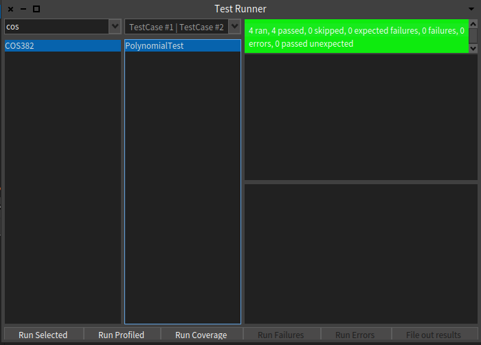
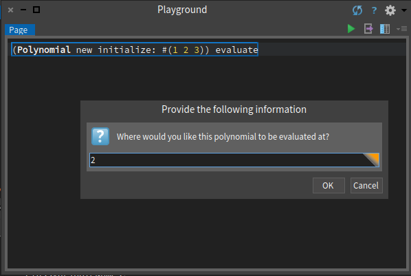
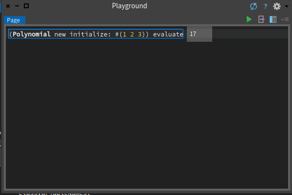
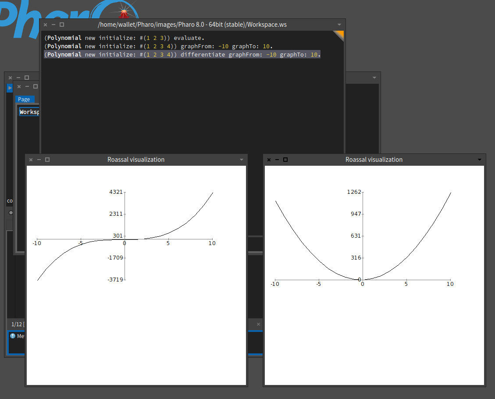

# A03_ParadigmOO_Smalltalk

## Unit test

Most non-interactive methods have their unit test implemented in the `PolynomialTest` class.

The effect of running the unit tests is shown in the image below:

## Evaluate method

The interactive evaluate method sends a prompt to the user, and evaluates based on the number given by the user, the effect is shown below:

## Graph method

The `graphFrom:graphTo:` method displays a plot of the given polynomial, where the effect is shown below:

